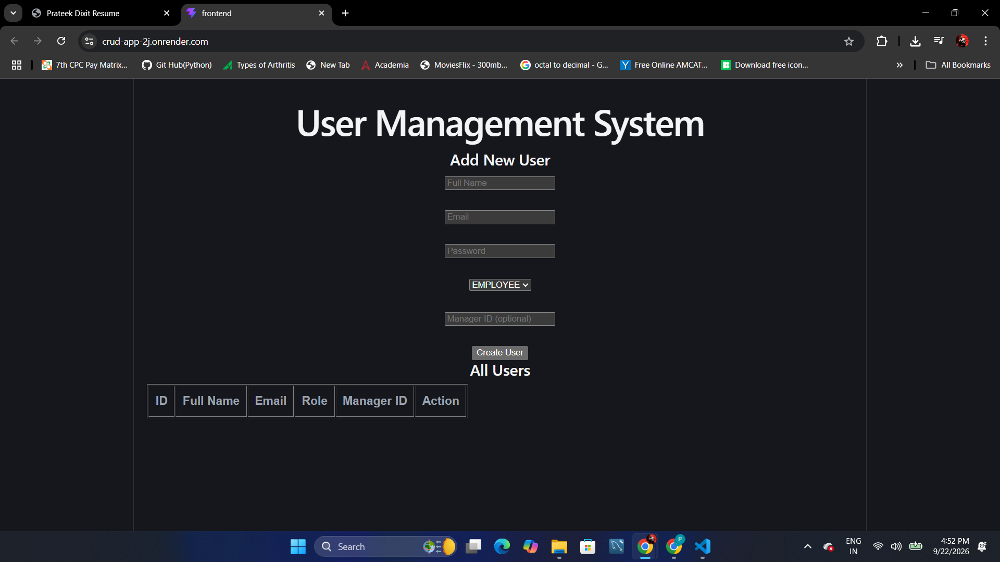
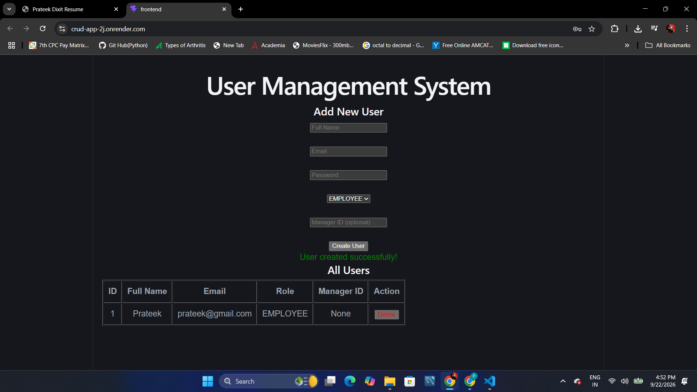
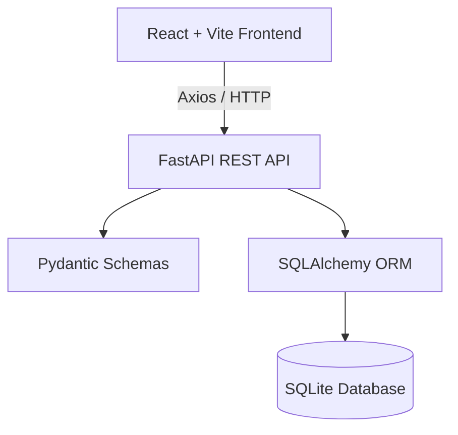
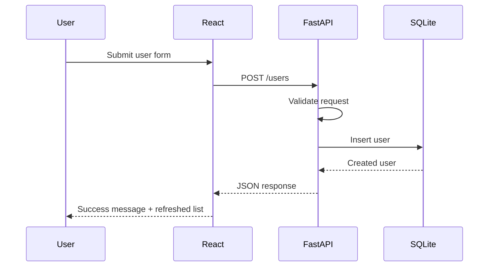

# User Management System

A full-stack CRUD User Management System built with **React, Vite,
FastAPI, SQLAlchemy, and SQLite**.

[](https://crud-app-2i.onrender.com)
[](https://crud-app-2i.onrender.com/docs)
[](https://react.dev/)
[](https://fastapi.tiangolo.com/)

## 🔗 Quick Links

-   **[Live Application](https://crud-app-2i.onrender.com)**
-   **[Interactive API
    Documentation](https://crud-app-2i.onrender.com/docs)**
-   **[GitHub Repository](https://github.com/Prateekdixit200/Crud-app)**

> The live application is deployed on Render. The backend exposes
> interactive Swagger/OpenAPI documentation at `/docs`.

## 📸 Screenshots

### Application Interface



### Creating a User



## ✨ Features

-   Create users
-   Read/list all users
-   Retrieve an individual user by ID
-   Delete users
-   Employee and Manager roles
-   Optional Manager ID assignment
-   REST API architecture
-   Interactive Swagger/OpenAPI documentation
-   React frontend with Axios
-   SQLAlchemy ORM
-   SQLite persistence
-   CORS-enabled frontend/backend communication
-   Render deployment

## 🏗️ Architecture



## 🔄 Application Flow



## 🛠️ Tech Stack

### Frontend

-   React
-   Vite
-   JavaScript
-   Axios
-   HTML5
-   CSS3

### Backend

-   Python
-   FastAPI
-   Uvicorn
-   SQLAlchemy
-   Pydantic
-   SQLite
-   bcrypt

### Tools & Deployment

-   Git
-   GitHub
-   Render
-   VS Code

## 📁 Project Structure

``` text
Crud-app/
├── backend/
│   ├── app.py
│   ├── database.py
│   ├── models.py
│   ├── routers.py
│   ├── schemas.py
│   ├── requirements.txt
│   └── users.db
│
├── frontend/
│   ├── public/
│   ├── src/
│   │   ├── assets/
│   │   ├── App.jsx
│   │   ├── App.css
│   │   ├── index.css
│   │   └── main.jsx
│   ├── package.json
│   ├── package-lock.json
│   └── vite.config.js
│
├── screenshots/
│   ├── frontend-interface.png
│   └── user-created.png
│
└── README.md
```

## 🔌 API Endpoints

  Method     Endpoint             Description
  ---------- -------------------- -----------------------
  `GET`      `/`                  Root/health response
  `GET`      `/users`             Retrieve all users
  `POST`     `/users`             Create a new user
  `GET`      `/users/{user_id}`   Retrieve a user by ID
  `DELETE`   `/users/{user_id}`   Delete a user

### Example `POST /users` request

``` json
{
  "email": "user@example.com",
  "password": "Password123!",
  "full_name": "John Doe",
  "role": "EMPLOYEE",
  "manager_id": null
}
```

## ▶️ Run Locally

### 1. Clone the repository

``` bash
git clone https://github.com/Prateekdixit200/Crud-app.git
cd Crud-app
```

### 2. Start the backend

``` bash
cd backend
python -m venv venv
```

Windows:

``` bash
venv\Scripts\activate
```

Install dependencies:

``` bash
pip install -r requirements.txt
```

Start FastAPI:

``` bash
uvicorn app:app --reload
```

Backend:

``` text
http://127.0.0.1:8000
```

Swagger:

``` text
http://127.0.0.1:8000/docs
```

### 3. Start the frontend

Open another terminal:

``` bash
cd frontend
npm install
npm run dev
```

Frontend:

``` text
http://localhost:5173
```

## 🧪 CRUD Workflow

```{=html}
<details>
```
```{=html}
<summary>
```
`<strong>`{=html}1. Create a user`</strong>`{=html}
```{=html}
</summary>
```
Fill in the user form and select a role. The frontend sends a
`POST /users` request to FastAPI.

```{=html}
</details>
```
```{=html}
<details>
```
```{=html}
<summary>
```
`<strong>`{=html}2. Read users`</strong>`{=html}
```{=html}
</summary>
```
The application calls `GET /users` and displays the returned records in
the users table.

```{=html}
</details>
```
```{=html}
<details>
```
```{=html}
<summary>
```
`<strong>`{=html}3. Read a single user`</strong>`{=html}
```{=html}
</summary>
```
The backend supports `GET /users/{user_id}` for retrieving an individual
record.

```{=html}
</details>
```
```{=html}
<details>
```
```{=html}
<summary>
```
`<strong>`{=html}4. Delete a user`</strong>`{=html}
```{=html}
</summary>
```
Clicking **Delete** sends a `DELETE /users/{id}` request and refreshes
the user list.

```{=html}
</details>
```
## 🎯 What This Project Demonstrates

-   Full-stack frontend/backend integration
-   REST API development with FastAPI
-   CRUD operations
-   Database modeling with SQLAlchemy
-   Request/response validation with Pydantic
-   React state and event handling
-   Axios-based API communication
-   CORS configuration
-   Git/GitHub version control
-   Cloud deployment with Render

## 🔮 Future Improvements

-   PostgreSQL for production-grade persistent storage
-   JWT authentication and authorization
-   User update/edit functionality
-   Search and filtering
-   Pagination
-   Better form validation
-   Environment variables for API configuration
-   Automated backend/frontend testing
-   CI/CD pipeline
-   Improved responsive UI/UX

## 👨‍💻 Author

**Prateek Dixit**

-   GitHub: [Prateekdixit200](https://github.com/Prateekdixit200)

------------------------------------------------------------------------

⭐ If you find this project useful, feel free to explore the repository
and try the live application.
